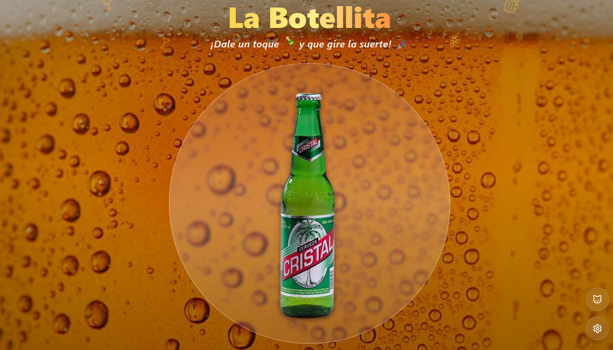

# 🍾 La Botellita

<div align="center">
  
  
  [¡Juega Ahora!](https://la-botellita.onrender.com)
</div>

## 📋 Tabla de Contenidos

- [🎮 Descripción](#-descripción)
- [✨ Características](#-características)
- [🚀 Demo](#-demo)
- [📱 Progressive Web App (PWA)](#-progressive-web-app-pwa)
- [⚙️ Tecnologías](#️-tecnologías)
- [🛠️ Instalación](#️-instalación)
- [🎯 Uso](#-uso)
- [👥 Contribuir](#-contribuir)
- [📄 Licencia](#-licencia)

## 🎮 Descripción

La Botellita es una versión moderna y digital del clásico juego de la botella, diseñada para animar fiestas y reuniones sociales. Con una interfaz intuitiva y divertida, los jugadores pueden girar la botella virtualmente y disfrutar de diferentes ambientes y botellas personalizables.

## ✨ Características

- 🎲 Giro de botella suave y realista
- 🖼️ Múltiples fondos temáticos
- 🍾 Variedad de botellas para elegir
- 📱 Diseño responsivo
- 🎨 Interfaz moderna con Tailwind CSS
- ⚡ Rendimiento optimizado con Vite
- 🌐 Funciona sin conexión (PWA)
- 📲 Instalable en dispositivos móviles y escritorio

## 🚀 Demo

¡Prueba La Botellita ahora! Visita nuestra [Demo en vivo](https://la-botellita.onrender.com)

## 📱 Progressive Web App (PWA)

La Botellita es una Progressive Web App (PWA) que ofrece una experiencia similar a una aplicación nativa:

- 💾 Instalable en dispositivos móviles y escritorio
- 🔌 Funciona completamente sin conexión
- 🚀 Carga rápida y rendimiento optimizado
- 🔄 Actualizaciones automáticas

Para instalar la aplicación:

1. Visita la [aplicación web](https://la-botellita.onrender.com)
2. En tu navegador, verás un botón de "Instalar" o un ícono de "+" en la barra de direcciones
3. Sigue las instrucciones para instalar la app en tu dispositivo

## ⚙️ Tecnologías

- React
- TypeScript
- Tailwind CSS
- Vite
- Render (Despliegue)

## 🛠️ Instalación

1. Clona el repositorio:

```bash
git clone https://github.com/EduardoProfe666/la-botellita.git
```

2. Instala las dependencias:

```bash
pnpm install
```

3. Inicia el servidor de desarrollo:

```bash
pnpm dev
```

## 🎯 Uso

1. Abre la aplicación en tu navegador
2. Selecciona una botella de tu preferencia
3. Elige un fondo que se ajuste al ambiente
4. ¡Haz clic en la botella para girarla!

## 👥 Contribuir

Las contribuciones son siempre bienvenidas. Por favor, lee las guías de contribución antes de enviar un pull request.

1. Fork el proyecto
2. Crea tu rama de características (`git checkout -b feature/AmazingFeature`)
3. Commit tus cambios (`git commit -m 'Add some AmazingFeature'`)
4. Push a la rama (`git push origin feature/AmazingFeature`)
5. Abre un Pull Request

## 📄 Licencia

Este proyecto está licenciado bajo la Licencia MIT - ver el archivo [LICENSE](LICENSE) para más detalles.
